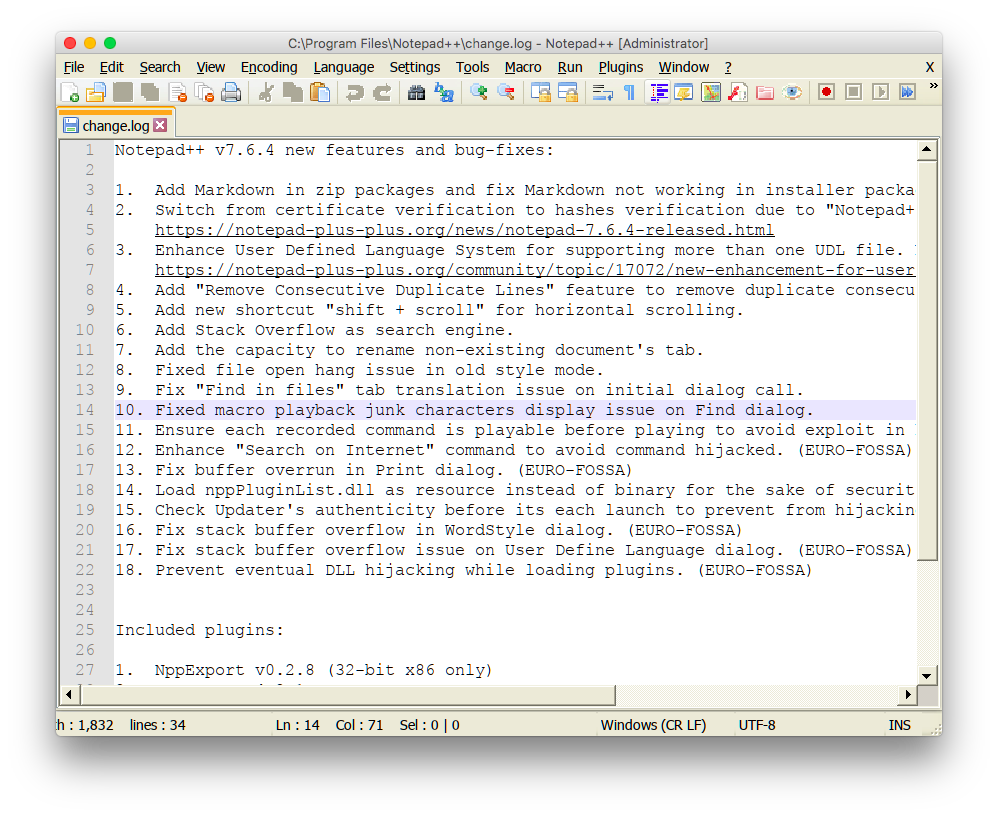

# Wine config



## Enable font anti-alias

```bash
winetricks fontsmooth=bgr
```

## Install modern theme

- https://askubuntu.com/questions/219791/improve-gui-appearance-of-wine-applications

```bash
winecfg
```

1. Download [luna theme](http://www.mediafire.com/download/dnzzmnebm6v/luna.rar)
2. Install it
3. And adjust DPI
